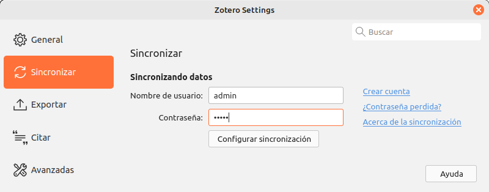

# Dockerized-Zotero

This repository allows you to run the Zotero data server locally using docker containers, and easily build the Zotero client application. It is inspired by [ZotPrime](https://github.com/FiligranHQ/zotprime).

Before use, make sure you have Docker installed. For instructions on how to install Docker Desktop, see: [Install Docker Engine](https://docs.docker.com/engine/install).

## Zotero Server 

### Initialize

As a first step, it is necessary to download the zotero source code and its dependencies. Next, we need to initialize the database and configure the server parameters. 

1. Change to the zotero data server folder: 
```bash
$ cd zotero-dataserver
```

2. Download souce code and configure the server: 
```bash
$ chmod +x init.sh
$ ./init.sh
```

_Note_: The zotero source code is cloned from the following official repositories:
- [Zotero / dataserver](https://github.com/zotero/dataserver.git)
- [Zotero / stream-server](https://github.com/zotero/stream-server.git)
- [Zotero / tinymce-clean-server](https://github.com/zotero/tinymce-clean-server.git)
- [ZendFramework / zf1](https://github.com/zotero/tinymce-clean-server.git)


### Run Data Server

1. Change to the zotero data server folder: 
```bash
$ cd zotero-dataserver
```

2. Download souce code and configure the server: 
```bash
$ sudo docker compose up -d
```

*Available endpoints*:

| Name          | URL                                           |
| ------------- | --------------------------------------------- |
| Zotero API    | http://localhost:8080                         |
| S3 Web UI     | http://localhost:8082                         |
| PHPMyAdmin    | http://localhost:8083                         |

*Default login/password*:

| Name          | Login                    | Password           |
| ------------- | ------------------------ | ------------------ |
| Zotero API    | admin                    | admin              |
| S3 Web UI     | zotero                   | zoterodocker       |
| PHPMyAdmin    | root                     | zotero             |


## Zotero Client 

### Build

1. Change to the zotero client folder: 
```bash
$ cd zotero-client
```

2. Build and run Zotero: 
```bash
$ sudo docker compose up [linux|windows]
```

The build will be placed in the _./zotero/app/staging_ folder in unpackaged form. The new files will be copied in this folder after finishing the compilation and closing zotero.

### First usage

*Run*:
```bash
$ ./staging/Zotero_VERSION/zotero(.exe)
```

*Connect with the default user and password*:

| Name          | Login                    | Password           |
| ------------- | ------------------------ | ------------------ |
| Zotero        | admin                    | admin              |

[comment]: 
